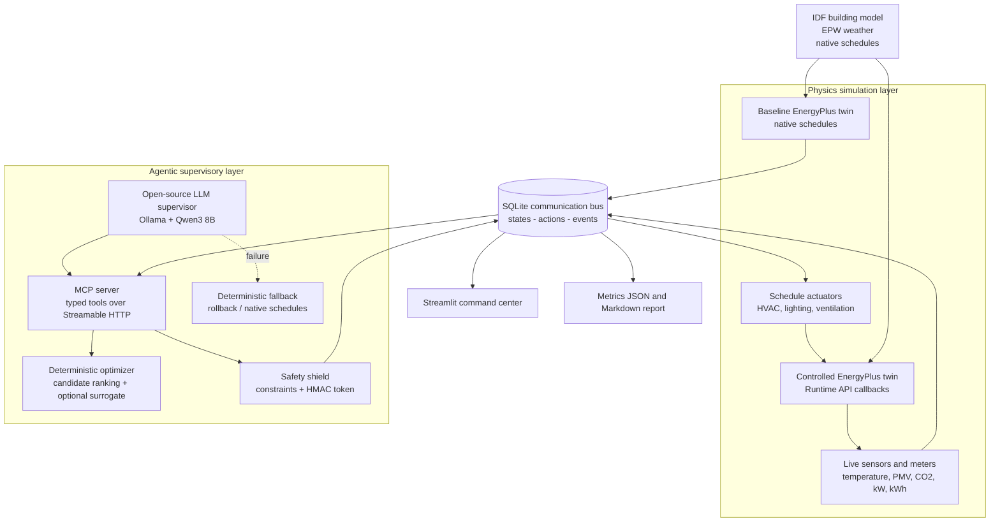

# EcoPilot System Architecture Document

**Project:** EcoPilot - A Safety-Constrained Agentic Digital Twin for Autonomous Building Energy Optimization  
**Hackathon:** Honeywell Eco-Loop Building Agents  
**Version:** 1.0  
**Date:** July 2026  
**Prepared by:** EcoPilot Team

> **Purpose.** This document explains the implemented system architecture, MCP tool-calling design, prompt strategy, latency management, safety controls, runtime logging, deployment topology, and current proof-of-concept limitations.

---

## 1. Executive Summary

EcoPilot is a closed-loop building-control proof of concept built around two synchronized EnergyPlus simulations. The **baseline twin** runs the building's native schedules, while the **controlled twin** accepts runtime schedule overrides. Both twins use the same building model, weather file, and simulation horizon, making the measured difference attributable to the control strategy rather than to different test conditions.

An open-source LLM running through Ollama acts as a **supervisory agent**, not as an unrestricted numerical controller. The agent reads structured building state through Model Context Protocol (MCP) tools, requests deterministic control candidates, validates the selected action, and queues an approved action. The EnergyPlus process independently rechecks the action before writing to any actuator.

The architecture is designed around five principles:

1. **Measurability:** baseline and controlled runs produce directly comparable kWh, demand, comfort, and IAQ metrics.
2. **Safety:** comfort, IAQ, actuator bounds, and thermostat deadband are hard constraints.
3. **Explainability:** every action contains a mode, reason, confidence, target values, and audit status.
4. **Fault tolerance:** EnergyPlus never waits for the LLM; deterministic fallback and native-schedule rollback remain available.
5. **Reproducibility:** configuration, logs, telemetry, actions, reports, and tests are retained in the repository.

## 2. Scope and Design Decisions

### 2.1 Current PoC scope

EcoPilot currently controls schedule-based EnergyPlus actuators for cooling, heating, lighting, and ventilation when those exchange points are exposed by the chosen IDF. It observes building and zone telemetry including facility power, cumulative electricity, peak demand, temperature, occupancy, humidity, PMV, and CO₂ where the model supports those signals.

### 2.2 Key architecture decisions

| Decision | Reason |
|---|---|
| Two identical EnergyPlus twins | Provides a fair, live baseline-versus-controlled comparison. |
| LLM as supervisor, not direct controller | Prevents hallucinated or malformed values from reaching actuators. |
| MCP tools as the only agent interface | Creates typed, auditable boundaries between reasoning and execution. |
| SQLite as the communication bus | Decouples processes and preserves state, actions, and events. |
| Deterministic optimizer and safety shield | Makes numerical ranking and hard constraints repeatable. |
| Short-lived action-bound approval tokens | Prevents action modification, replay, and stale execution. |
| Runtime revalidation inside EnergyPlus | Protects against state changes between approval and actuation. |
| Native-schedule reset as fallback | Ensures the building returns to a known-safe operating policy. |

## 3. System Architecture Overview



### 3.1 End-to-end data path

1. The EnergyPlus Runtime API starts one baseline process and one controlled process.
2. Runtime callbacks read variables and meters at each completed zone timestep.
3. Each twin publishes a compact `BuildingState` record to SQLite.
4. The supervisory agent connects to the MCP server and discovers its available tools dynamically.
5. The agent reads the latest controlled state, recent history, and baseline comparison.
6. The deterministic optimizer creates and ranks feasible operating modes.
7. The safety shield validates the selected action and issues a short-lived token bound to the exact action digest.
8. The apply tool verifies the token and inserts the action into the SQLite action queue.
9. The controlled EnergyPlus callback dequeues the action, validates it again against the newest state, and writes approved values to schedule actuators.
10. Subsequent telemetry verifies the result, while the dashboard and report generator read the same auditable data store.

## 4. Component Architecture

| Layer / component | Responsibility | Main implementation |
|---|---|---|
| Model preparation | Creates baseline and controlled IDFs and selects the EPW weather file. | `scripts/setup_models.py`, `energyplus/idf_parser.py` |
| Baseline twin | Runs native schedules without external actuation. | `energyplus/runner.py` |
| Controlled twin | Registers callbacks, reads approved actions, revalidates, and applies actuators. | `energyplus/runner.py`, `energyplus/callbacks.py` |
| Exchange-point registry | Requests variables, discovers handles, maps schedules, and exports the registry. | `energyplus/handle_registry.py` |
| Sensor reader | Builds compact zone and facility telemetry objects. | `energyplus/sensor_reader.py` |
| Actuator writer | Applies or resets cooling, heating, lighting, and ventilation schedules. | `energyplus/actuator_writer.py` |
| Runtime monitor | Captures EnergyPlus messages, severity, and progress. | `energyplus/runtime_monitor.py` |
| Communication bus | Stores states, actions, approval tokens, statuses, and runtime events. | `core/storage.py` |
| MCP server | Exposes model, state, optimization, validation, actuation, recovery, and reporting tools. | `mcp_server/server.py` |
| Supervisory agent | Executes bounded tool-use cycles with Ollama or deterministic mode. | `agent/orchestrator.py` |
| Data contracts | Validates building states, actions, candidates, and validation results. | `agent/schemas.py` |
| Optimizer | Generates operating modes and minimizes predicted power plus penalties. | `control/optimizer.py` |
| Optional surrogate | Uses a trained gradient-boosting model when available; otherwise uses a deterministic heuristic. | `control/surrogate.py` |
| Safety shield | Enforces constraints and manages action-bound HMAC approval tokens. | `control/constraints.py`, `control/safety_shield.py` |
| Fallback controller | Prioritizes comfort recovery or resets to native schedules. | `control/fallback_controller.py` |
| Command center | Displays savings, peak demand, comfort, IAQ, actions, zones, and health. | `dashboard/app.py`, `dashboard/charts.py`, `dashboard/theme.py` |
| Experiment/report layer | Launches processes, computes metrics, and generates the final Markdown report. | `experiments/run_scenarios.py`, `compare_runs.py`, `generate_report.py` |

## 5. Closed-Loop Runtime Sequence

```mermaid
sequenceDiagram
    participant EP as Controlled EnergyPlus
    participant DB as SQLite Bus
    participant AG as EcoPilot Agent
    participant MCP as MCP Server
    participant OPT as Optimizer
    participant SAFE as Safety Shield

    EP->>DB: Publish latest BuildingState
    AG->>MCP: get_live_building_state
    MCP->>DB: Read controlled state
    DB-->>MCP: Compact state
    AG->>MCP: get_recent_history / compare_with_baseline
    AG->>MCP: optimize_control_action
    MCP->>OPT: Rank feasible candidates
    OPT-->>MCP: Selected action + candidate scores
    AG->>MCP: validate_control_action
    MCP->>SAFE: Schema + constraints
    SAFE-->>MCP: Approval token or rejection
    AG->>MCP: apply_control_action(action, token)
    MCP->>SAFE: Verify digest, signature, expiry, current state
    MCP->>DB: Queue approved action
    EP->>DB: Dequeue next approved action
    EP->>SAFE: Runtime safety recheck
    alt Approved
        EP->>EP: Apply schedule actuator values
        EP->>DB: Mark applied / completed and publish results
    else Unsafe or stale
        EP->>EP: Reset native schedules
        EP->>DB: Mark rejected and log reason
    end
```

The controlled callback operates in two phases:

- **Before the zone timestep:** load the next approved action, perform runtime revalidation, and write actuator values.
- **After zone reporting:** read telemetry, publish the new state, complete expired hold periods, and reset actuators when required.

## 6. MCP Tool-Calling Architecture

The MCP server provides eleven typed tools. The LLM cannot access EnergyPlus, SQLite, or files directly; it must use these tools.

| Tool group | Tools | Purpose |
|---|---|---|
| Model inspection | `inspect_building_model_tool`, `discover_exchange_points_tool` | Inspect zones, schedules, sensors, meters, and available actuators. |
| State retrieval | `get_live_building_state_tool`, `get_recent_history_tool`, `compare_with_baseline_tool` | Provide compact current and historical evidence. |
| Decision support | `optimize_control_action_tool` | Generate and rank deterministic candidates. |
| Safety and execution | `validate_control_action_tool`, `apply_control_action_tool` | Validate the exact action, issue/verify a token, and queue it. |
| Recovery and diagnostics | `rollback_last_action_tool`, `read_runtime_messages_tool` | Restore safe schedules and inspect bounded runtime events. |
| Reporting | `generate_final_report_tool` | Produce final evaluation metrics from both runs. |

### 6.1 Agent cycle

The normal LLM cycle is:

`read state -> read history -> compare -> optimize -> validate -> apply -> summarize`

The agent supports a bounded number of tool rounds. If the LLM fails to apply a safe action, the orchestrator automatically runs the deterministic supervisory cycle. This ensures that the control workflow completes safely even when the model produces no tool call, times out, or returns an incomplete response.

## 7. Deterministic Optimization

The optimizer generates operating modes such as `NORMAL`, `ECO`, `PEAK_LIMIT`, `PRECOOL`, `IAQ_RECOVERY`, `UNOCCUPIED_SETBACK`, `COMFORT_RECOVERY`, and `SAFE_FALLBACK` according to current occupancy, outdoor temperature, time, demand, PMV, temperature, and CO₂ conditions.

For each valid candidate, the optimizer computes:

`total score = predicted kW + comfort penalty + IAQ penalty + switching penalty`

Hard comfort violations receive very large penalties. Switching penalties discourage unnecessary oscillation between setpoints. The lowest-scoring valid action is selected. When `data/surrogate.joblib` exists, an optional `HistGradientBoostingRegressor` predicts next-step power; otherwise a deterministic heuristic estimates the effect of cooling, lighting, and ventilation changes.

## 8. Safety, Security, and Recovery

EcoPilot applies defense in depth rather than relying on a single model decision.

### 8.1 Safety chain

1. **Pydantic validation:** rejects malformed states and actions.
2. **Candidate filtering:** optimizer candidates must pass deterministic constraints before ranking.
3. **Action validation:** the MCP safety tool evaluates the chosen action against the latest state.
4. **Approval token:** an HMAC token contains the SHA-256 digest of the exact action and its simulation-step expiry.
5. **Apply-time verification:** token signature, digest, expiry, and current safety conditions are checked again.
6. **EnergyPlus runtime recheck:** the controlled process independently validates the queued action immediately before actuation.
7. **Bounded hold period:** an action is active for a limited number of simulation steps.
8. **Automatic reset:** expired, unsafe, malformed, or unoccupied actions return to native schedules unless explicitly authorized.

### 8.2 Default hard boundaries

| Boundary | Default |
|---|---:|
| Occupied temperature range | 21-26 °C |
| Absolute PMV limit | 0.7 |
| CO₂ limit | 1,000 ppm |
| Heating setpoint range | 18-22 °C |
| Cooling setpoint range | 22-27 °C |
| Minimum thermostat deadband | 2 °C |
| Minimum action confidence | 0.50 |

The checker also blocks reduced ventilation near the CO₂ limit, unsafe warm/cold actions near comfort boundaries, and unauthorized control when the building is unoccupied. Low lighting or unusually low ventilation produces warnings for operator visibility.

## 9. Prompt Engineering Strategy

The system prompt uses a **tool-first, evidence-first** policy:

- Never invent measurements or actuator availability.
- Read the newest state and recent history before acting.
- Use the optimizer instead of performing unrestricted numerical control.
- Validate every action and use the exact returned token.
- Never modify an action after validation.
- Prefer rollback or no action when evidence is absent, stale, malformed, or unsafe.
- Treat comfort, IAQ, deadband, and actuator limits as higher priority than energy savings.
- Keep explanations brief and exclude raw simulation logs from the model context.

This prompt is intentionally short. Detailed calculations and safety logic live in tools, where behavior is deterministic, testable, and auditable.

## 10. Latency Management

EcoPilot separates the real-time simulation path from the slower reasoning path.

| Mechanism | Architecture benefit |
|---|---|
| Process isolation | Baseline twin, controlled twin, MCP server, agent, and dashboard run independently. |
| Non-blocking EnergyPlus callback | The callback consumes already-approved actions; it never waits for an LLM response. |
| Supervisory interval | The agent runs at a configurable wall-clock interval, defaulting to 2 seconds. |
| Bounded tool loop | The LLM is limited to a configurable maximum, defaulting to 8 tool rounds per cycle. |
| Compact state | The model receives structured state rather than complete EnergyPlus output. |
| Bounded history | Recent-history requests default to 12 states. |
| Bounded action duration | Hold steps prevent indefinite overrides and reduce oscillation. |
| Deterministic fallback | A safe control cycle remains available when Ollama is slow or unavailable. |

## 11. Runtime Logs and Long-Context Management

Lengthy EnergyPlus logs are deliberately kept out of the main LLM prompt.

- EnergyPlus console messages and progress are captured by the runtime monitor.
- Structured events are stored in SQLite with timestamp, severity, source, message, and optional payload.
- Process logs are written under `data/live/`, including baseline, controlled, MCP, and agent logs.
- The `read_runtime_messages_tool` returns only a bounded number of recent events and can filter by severity.
- State/history tools return compact JSON records, while full telemetry remains available to the dashboard and report generator.
- The dashboard exposes warnings, errors, action status, and complete audit trails without increasing prompt length.

This design keeps prompt latency predictable while preserving full engineering evidence for evaluators.

## 12. Data Model and Observability

SQLite contains three primary logical streams:

| Stream | Important fields | Use |
|---|---|---|
| `states` | run ID, mode, simulation step/time, serialized `BuildingState` | Twin telemetry and performance curves. |
| `actions` | action ID, source, created step, status, token, payload, applied step | Approval queue and audit lifecycle. |
| `events` | timestamp, severity, source, message, payload | Diagnostics, safety rejection, runtime health. |

Action status moves through `approved -> applied -> completed`; malformed or unsafe actions become `rejected`. The dashboard and final report calculate energy savings, peak reduction, occupied comfort compliance, CO₂ compliance, applied/rejected actions, warnings, and errors from the stored evidence.

## 13. Deployment Topology

The complete demonstration is launched with:

```bash
python -m experiments.run_scenarios
```

For integration testing without an LLM:

```bash
python -m experiments.run_scenarios --deterministic-agent --realtime-delay 0.25
```

The launcher starts the MCP server, supervisory agent, baseline twin, and controlled twin as separate subprocesses, waits for both simulations, generates the final report, and terminates support processes cleanly. The Streamlit dashboard is started separately so it can remain visible throughout the run.

## 14. Hackathon Requirements Traceability

| Requirement | EcoPilot implementation | Status / evidence |
|---|---|---|
| High-fidelity EnergyPlus simulation | Two EnergyPlus Runtime API processes using the same IDF and EPW. | Implemented in `energyplus/runner.py`. |
| Open-source LLM | Local Ollama model, default `qwen3:8b`. | Implemented in `agent/orchestrator.py`. |
| MCP server / agentic tools | Eleven typed tools over Streamable HTTP. | Implemented in `mcp_server/`. |
| Continuous feedback | Zone/facility telemetry published after every zone timestep. | Implemented in callbacks and sensor reader. |
| Reasoning against comfort and demand targets | Agent reads state/history; optimizer ranks modes with comfort/IAQ penalties. | Implemented. |
| AI-to-EnergyPlus control | Approved schedule values are written through EnergyPlus actuators. | Implemented; actuator mapping must be verified for the final IDF. |
| Forward injection without human code edits | Controlled callback consumes the action queue during the active run. | Implemented. |
| Quantitative dashboard | Baseline vs controlled energy/demand, comfort, IAQ, action and health panels. | Implemented in `dashboard/`. |
| Self-correction / safe recovery | Deterministic fallback, runtime recheck, action expiry, native-schedule reset. | Implemented. |
| Architecture report | This document. | Complete. |
| Three-minute demonstration video | Live twin, action, savings, safety rejection, and recovery sequence. | Must be recorded after final validation. |

## 15. Current PoC Limitations and Final Validation

The architecture is operational, but the following checks must be completed before claiming final results:

1. Verify the selected cooling, heating, lighting, and ventilation handles in `data/live/exchange_points.json` for the final IDF.
2. Confirm that PMV inputs and `ZoneAirContaminantBalance` are enabled so comfort and CO₂ evidence are real rather than unavailable.
3. Run synchronized baseline and controlled scenarios to obtain final kWh and peak-demand reductions; do not present placeholder metrics.
4. Test malformed actions, modified tokens, expired tokens, missing Ollama, and runtime warnings to demonstrate recovery.
5. Train the optional surrogate model only if sufficient rollout data is available; otherwise describe the current heuristic honestly.
6. Carbon-intensity or tariff-aware optimization is an extension point and should not be presented as implemented unless an external signal adapter is added and tested.
7. Replace the default approval secret before the demo and keep local paths, secrets, and raw diagnostics out of judge-facing UI panels.

## 16. Conclusion

EcoPilot combines a high-fidelity physics engine with an agentic supervisory layer while keeping numerical control and safety enforcement deterministic. The dual-twin design proves impact, the MCP boundary makes actions inspectable, the token and runtime-recheck chain prevents unsafe execution, and process isolation ensures that an LLM failure cannot stop the building simulation. The resulting PoC is measurable, explainable, fault-tolerant, and aligned with the Eco-Loop Building Agents objective.
